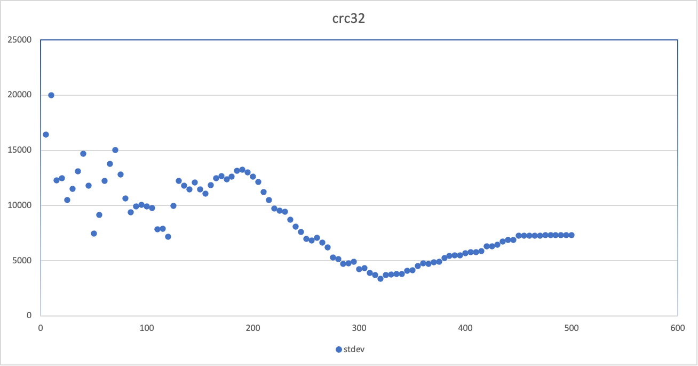
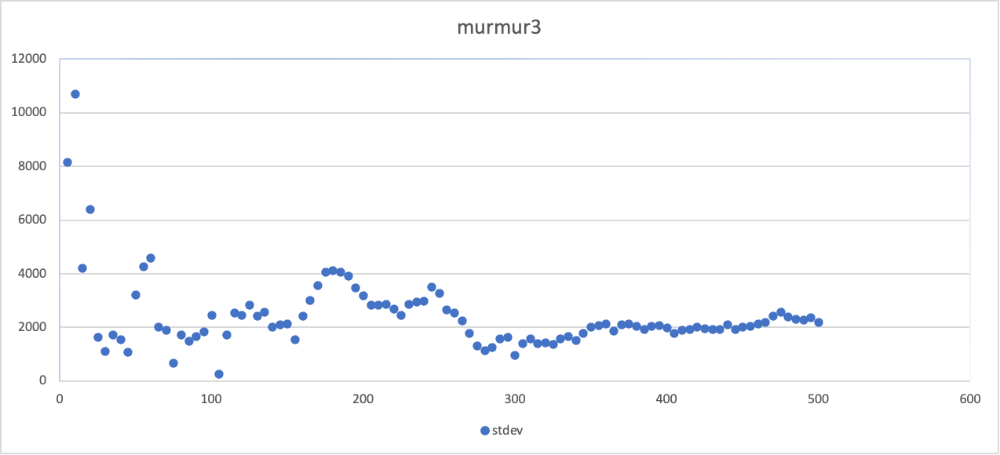
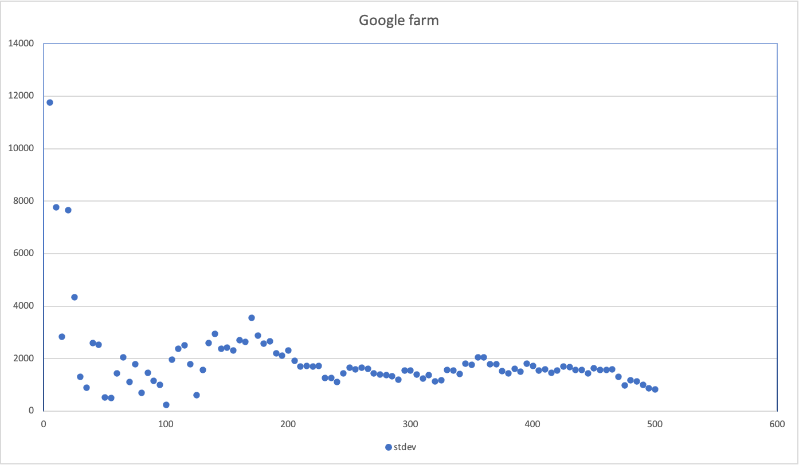

# A Simple ConsistentHash example

A quick implementation of vnode consistent hash for study load balancing.
Trying different hash algorithm to see their performance when vnode number increases:
- crc32 hash come along golang
- [Murmur3](github.com/spaolacci/murmur3)
- [Google FarmHash](https://github.com/dgryski/go-farm)

Note: Only tried with the simplest usage of these libraries. Result could be quite different if tuning the algorithm options.

####Tests

1. Add 3 actual servers
2. vnodes multiply from 5 to 500, each time add 5
3. Using 8 * 10000 data to see how they are distributed to actual servers
4. Check the distribution standard deviation

####Result

* crc32 get its smallest stdev when there is around 320 vnodes for each actual server.
* murmur3 get small stdev quickly when there is around 100 vnodes for each actual server.
* Google farm seems to have the best default performance. it get small stdev quickly and most stdev is under 2000.

crc32

{width="50%"}

Murmur3

{width="50%"}

Google Farm

{width="50%"}

####More can be done
* What is there is more actual servers, for example, 1000 actual servers? 
* What are other promising hash algorithms?
* Could the data used for hash impact the result?
* What if we tuning the options of these algorithms?